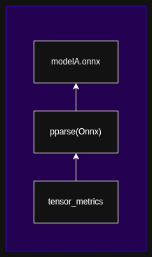
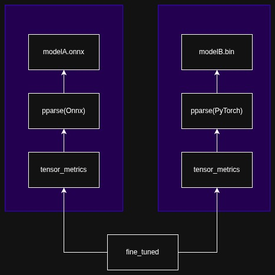

### 6.8.3 Yannt Analysis

<div class="h3-style">Overview<div>

We have the pparse parsing framework that is responsible for generating the extraction tree and associated node/parse tree. The parse trees have some partial interpretation by the very nature of the design of their formats. In an effort to make them have more meaningful interfaces like "get_tensor()" or "get_graph()" and return a numpy array or netx graph, we have what pparse calls the "view" wrapper. This is an intermediate representation (IR) or interpretation of the node tree. It is this IR that is used by the analysis factors. The original parse tree (from pparse) is intentionally leaked to the analysis factors so they may depend on more insight from the IR.

<div class="h3-style">Components</div>

As a first class plugin of yannt, there is an analysis framework. The analysis framework has several core components:

- **AnalysisFactor** - The unit of code responsible for interpreting or deriving some new knowledge from the output of another node (i.e. performs analysis). Each factor has multiple dependencies and each dependency is another node of input for this factor's code.

- **AnalysisInput** - A sub-class of `AnalysisFactor`, these input nodes take user defined input as the roots of the network of `AnalysisFactor`s. `AnalysisInput` nodes have no dependencies of the tree, they instead have user given input dependencies.0

- **AnalysisProcedure** - An object class that manages the node tree of AnalysisFactor objects classes. Its important to note that `AnalysisProcedures` only track the object classes and not the object instances of `AnalysisFactor`s. The distinction enables `AnalysisProcedure`s to be reused, merged, and optimized. The `AnalysisProcedure` is responsible for sorting and initializing the runtime manager of the factor's instances, the `AnalysisProcess`.

- **AnalysisProcess** - An object that owns the object _instances_ of factors that are executing or have executed. The `AnalysisProcess` also owns the results of all of the `AnalysisFactors` outputs for use by any requested `AnalysisReport`s.

- **AnalysisReport** - An object that is bound to an `AnalysisProcedure` and is responsible for filtering out and performing any final interpretation of rendering of output for the consumer or user of the desired data. Without the report, a user will receive all of the data generated by the procedure in an associative array that isn't easy on human eyes or consumption.

- **AnalysisFramework** (Probably will be renamed), is the object where all the `AnalysisFactor`, `AnalysisInput`, `AnalysisProcedure`, and `AnalysisReport` object classes are registered. (Think of this as an instance of a namespace.)

- **FRAMEWORKS** - (Probably will be renamed), is the global singleton that houses all of the frameworks in the python process. All requests implicitly or explicitly provide a framework reference. The default framework is "default", but anyone can organize factors, procedures, and reports into different frameworks. (Think of this as a registry of namespaces.)

<div class="h3-style">Component Registration</div>

Component registration has been implemented to be flexible enough to run implicitly as an automatic registration as part of a plugin install (via python entry points), can be defined as a yaml configuration file (and also as a JSON configuration file), and nearly everything can be expressed as a CLI argument. The order of priority from highest to lowest is:

- CLI argument override everything.
- Conceptually, environment variables override configs and below, but NA atm.
- Configuration files override hard coded defaults and install defaults.
- Entrypoint setup overrides hard coded defaults.
- Hard coded defaults have the lowest priority.

Examples:

- **Entry points** - The analysis framework plugin looks for entry points in the `[project.entry-points."yannt_analysis_plugin"]` namespace.

  For example:

  ```toml
  [project.entry-points."yannt_analysis_plugin"]
  analysis_plugin_pparse = "thirdparty.yannt.analysis.pparse.plugin:register_analysis_plugin"
  ```

  `register_analysis_plugin` is then called as `register_analysis_plugin(framework)`:

  ```python
    def register_analysis_plugin(framework):

      # Register factors
      from thirdparty.yannt.analysis.pparse import PparseFormat
      framework.register_factor('pparse', ('thirdparty.yannt.analysis.pparse.inputs', 'PparseFormat'), {})
      framework.register_factor('tensor_character', ('thirdparty.yannt.analysis.pparse.tensors', 'TensorCharacter'))

      # Create procedure
      tensor_char_proc = framework.create_procedure(name='tensor_character')
      tensor_char_proc.add_input('model', factor='pparse')
      tensor_char_proc.add_factor('tensor_character', factor='tensor_character', dependencies=['model'])
  ```

  The above code creates a dependency tree of:

  

- **Yaml Configuration** - The frameworks, factors, and procedures can be defined in a `config.yaml` and specified as part of the analyze command as `yannt analyze --config config.yaml`.

  Example config:

  ```yaml
  config:

    frameworks:
    - framework:
        name: default
        factor_classes:
        - factor_class:
            name: pparse
            module: thirdparty.yannt.analysis.pparse.inputs
            class: PparseViewer
            config:
              registry:
                onnx: [ thirdparty.pparse.view.onnx, Onnx ]
                pytorch: [ thirdparty.pparse.view.pytorch, PyTorch ]

        - factor_class:
            name: tensor_character
            module: thirdparty.yannt.analysis.pparse.tensors
            class: TensorsCharacter

        - factor_class:
            name: fine_tuned
            module: thirdparty.yannt.analysis.pparse.plugin
            class: FineTuned

        report_classes:
        - report_class:
            name: fine_tuned
            module: thirdparty.yannt.analysis.pparse.plugin
            class: FineTunedReport

        procedures:
        - procedure:
            name: fine_tuned

            input_factors:
            - factor: { name: model_a, factor_class: pparse }
            - factor: { name: model_b, factor_class: pparse }

            worker_factors:
            - factor:
                name: tensor_character_a
                factor_class: tensor_character
                dependencies: [ model_a ]

            - factor:
                name: tensor_character_b
                factor_class: tensor_character
                dependencies: [ model_b ]

            - factor:
                name: fine_tuned
                factor_class: fine_tuned
                dependencies: [ tensor_character_a, tensor_character_b ]
  ```

  The yaml above create the dependency tree:

  

- **CLI Registration** - The CLI will override (or register from scratch) any of the example already shown above:

   Override an report registered in `config.yaml`.

  ```sh
     yannt analyze --config config.yaml --load report:name=fine_tuned,mod=myfork.plugin,clsFineTunedReportv2
  ```

  Do everything without `config.yaml`:

  ```sh
    yannt analyze \
      --load factor:name=pparse,mod=thirdparty.yannt.analysis.pparse.inputs,cls=PparseViewer \
      --load factor:name=pparse,parser_name=onnx,parser_mod=thirdparty.pparse.view.onnx,parser_cls=Onnx \
      --load factor:name=pparse,parser_name=pytorch,parser_mod=thirdparty.pparse.view.pytorch,parser_cls=PyTorch \
      --load factor:name=tensor_character,mod=thirdparty.yannt.analysis.pparse.tensors,cls=TensorCharacter \
      --load factor:name=fine_tuned,mod=thirdparty.yannt.analysis.pparse.plugin,cls=FineTuned \
      --load report:name=fine_tuned,mod=thirdparty.yannt.analysis.pparse.plugin,cls=FineTunedReport \
      --factor input:name=model_a,proc=fine_tuned,factor=pparse \
      --factor input:name=model_b,proc=fine_tuned,factor=pparse \
      --factor worker:name=tensor_character_a,proc=fine_tuned,factor=tensor_character,dependency=model_a \
      --factor worker:name=tensor_character_b,proc=fine_tuned,factor=tensor_character,dependency=model_b \
      --factor worker:name=fine_tuned,proc=fine_tuned,factor=fine_tuned,dependency=tensor_character_a \
      --factor worker:name=fine_tuned,proc=fine_tuned,factor=fine_tuned,dependency=tensor_character_b
  ```

  Its noisy, but all of the same configuration is now built into the environment (minus the actual request).

<div class="h3-style">Requesting Procedures</div>

Given that a procedure `fine_tuned` and `tensor_character` exists, we can run these several different ways:

- Request `fine_tuned` comparison procedure across 2 different models with `config.yaml`. The process will run in the `default` namespace and be run with the name `mine`. The procedure has two input factors and we also set those with the `--input` argument, specifying the name of the process, the name of the factor in the graph, and the relevant input those factors require.

  ```sh
  yannt analyze --breakpoint --config config.yaml \
    --load factor:name=pparse,mod=thirdparty.yannt.analysis.pparse.inputs,cls=PparseViewer \
    --load factor:name=pparse,parser_name=onnx,parser_mod=thirdparty.pparse.view.onnx,parser_cls=Onnx \
    --load factor:name=pparse,parser_name=pytorch,parser_mod=thirdparty.pparse.view.pytorch,parser_cls=PyTorch \
    --load factor:name=tensor_character,mod=thirdparty.yannt.analysis.pparse.tensors,cls=TensorCharacter \
    --load factor:name=fine_tuned,mod=thirdparty.yannt.analysis.pparse.plugin,cls=FineTuned \
    --load report:name=fine_tuned,mod=thirdparty.yannt.analysis.pparse.plugin,cls=FineTunedReport \
    --factor input:name=model_a,proc=fine_tuned,factor=pparse \
    --factor input:name=model_b,proc=fine_tuned,factor=pparse \
    --factor worker:name=tensor_character_a,proc=fine_tuned,factor=tensor_character,dependency=model_a \
    --factor worker:name=tensor_character_b,proc=fine_tuned,factor=tensor_character,dependency=model_b \
    --factor worker:name=fine_tuned,proc=fine_tuned,factor=fine_tuned,dependency=tensor_character_a \
    --factor worker:name=fine_tuned,proc=fine_tuned,factor=fine_tuned,dependency=tensor_character_b \
    --request process:name=mine,proc=fine_tuned \
    --input process:name=mine,factor=model_a,parser=onnx,path=models/yolo/yolov5su.onnx \
    --input process:name=mine,factor=model_b,parser=pytorch,path=models/yolo/yolov5su.pt
  ```

  Because of the `--breakpoint`, the above command with drop into a python debugger prompt. You can dump the output of the process results by typing: `processes['default-mine'].results` and hitting enter.

- Without `config.yaml`:

  ```sh
  yannt analyze --breakpoint --config config.yaml \
    --request process:name=mine,proc=fine_tuned \
    --input process:name=mine,factor=model_a,parser=onnx,path=models/yolo/yolov5su.onnx \
    --input process:name=mine,factor=model_b,parser=pytorch,path=models/yolo/yolov5su.pt
  ```

  Because of the `--breakpoint`, the above command with drop into a python debugger prompt. You can dump the output of the process results by typing: `processes['default-mine'].results` and hitting enter.

- NOTE: While not designed or implemented in yet, it wouldn't be much to include a request and input section into config to simplify the invocation to something like:

  ```sh
  yannt analyze --breakpoint --config config.yaml --config request.yaml
  ```
