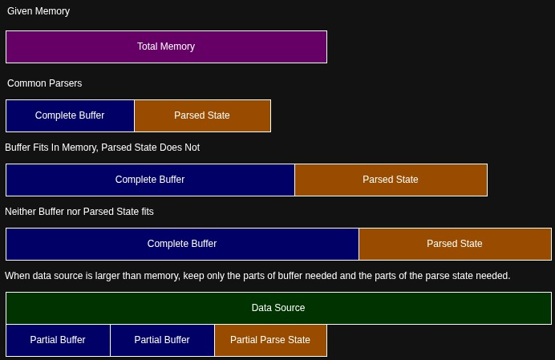
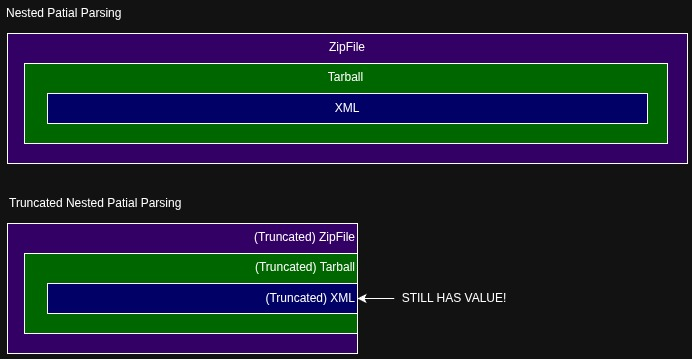
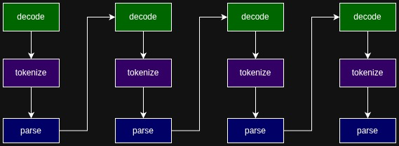
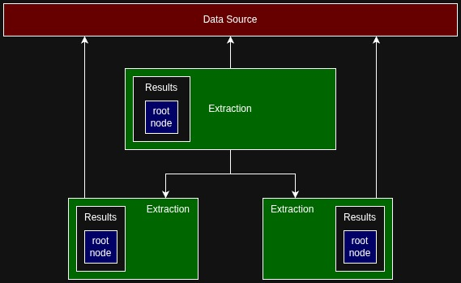
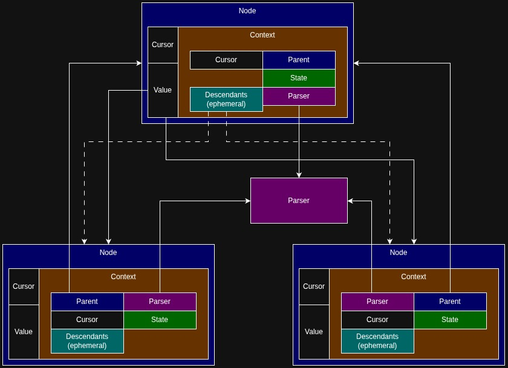
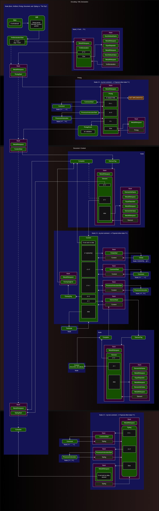

# Progressive Parsing

Common parsers only find value in a complete picture. Progressive parsing finds value in the frame as it comes into focus.

<!-- "Le mieux est l'ennemi du bien" (English: "The better is the enemy of the good") — Voltaire, La Bégueule (1772). -->

## Intro

For about a year now, I've been working on a parser of data file formats. I've wanted to write something about the effort, but its been difficult to isolate what's different about it without talking through _yet another_ parsing concept. Is what I've done novel? Probably not. But its something I don't see often and there appears to be even less documentation on the approach. Maybe its an anti-pattern? Don't know, but I do have a real problem that its solving.

Writing a parser is something that every software developer should have tried at some point. Often we attempt this kind of thing as a junior developer and then someone senior to us shakes their head and challenges why we would ever implement our own parser! All common data formats have their own parsers and many data formats are based on parsers that have been auto-generated from schemas. The message to the junior developer is that writing parsers is a waste of time, high risk, and low return on investment compared to all the other available resources.

I agree that junior developers should not be writing parsers for production. The major exception to "don't write a parser" is, any level of developer writing a parser for any particular target format is an incredible way to analyze a data format and learn from its construction. Looking at a schema doesn't often give a sense of how the data flows within a serialized data format (unless you've written a fair number of parsers).

## Terms

**Parsing** - If you look up [**parsing**](https://en.wikipedia.org/wiki/Parsing) on Wikipedia, you'll get something that talks about how to partition human languages or sentences. Further down the page, it mentions parsing of computer languages. In fact, if you attempt to look up any general knowledge for **parsing** on the internet, you'll mostly get articles and papers about parsing computer languages (e.g. LL parsers, LR parsers, and so forth). These computer languages are the ones that have grammars and usually defined what source code looks like or some other domain specific language.

To clarify, I am writing a "parser" intended to data file formats, not grammar defined language (e.g. things that have been serialized from a data structure to strings of bytes). 

**Binary** - A term I've found to be over used in many different contexts. Fundamentally, binary refers to the base 2 numbering system. Many individuals also use binary to refer to files that are not human readable or non-textual (even though all digital assets are binary!) Executables like ELF and PE also fall into the non-human readable category, therefore executable files are referred to as binary as well.

In my case, when I say I am writing a "binary parser", I mean I am "deserializing, decoding, and decomposing a string of bytes". It could be a MsgPack, it could be an XML, it could be a network packet, it could be an ELF. These are all serialized strings of bytes.

**Encoding** - Referring to the idea that a character is encoded as something other than a single 8-bit byte. Many legacy tools don't think about encodings. Modern tools only consider UTF-8. Internationally, there are a great many encodings, and they aren't all ANSI, ISO, and UTF based. To be fair, some systems have different bit lengths for bytes (although I work with none of those).

Encoding can also be abused (for good?) by considering data that is wrapped in anything is an encoding. For example, an AES encryption is an encoding. A libz compressed stream is an encoding. Granted, you generally need the entire previous block of data to proceed in both situations, but it is doable.

**Serialization** is the act of reading/writing a string of bytes from/to a storage location. Ideally in a way that is reusable, in constrast to saving something like runtime only pointers to disk that are likely never relevant again. (Note: IMO, serializing non-reloadable data is a **dump**.)

## Parser Resources

Lets suppose you listened a peer developer on your team and decided that there is no way you'll write your own parser. Where might you find the parser you need/want and what exactly do you end up with? Here is a _pessimistic_ list I've developed:

- **Standard library** - Many standard libraries have a collection of common formats like JSON or XML. Often, standard library provided parsers are written so generic that they may miss many edge case features and be more bloated than required to facilitate compatibility across all known platforms.

- **External library** - When your standard library is missing a parser or feature, one may reach for external libraries. A parser from an external library may be no better than a custom written one without _knowing_ the external parser is sufficiently maintained and _your_ use has been reviewed by a large enough community. Often we use these external dependencies with blind trust without knowing how they work or their implementation philosophy. Note: Anything we'd do to mitigate the unknown about an external library, we'd do to mitigate our own code as well.

- **Parser Generator** - Some parsers are developed based on a descriptor (e.g. Kaitai struct) or based on schemas (e.g. protobuf, flatbuffers). Often, these types of parsers are pre-packaged as pre-generated external libraries, but as a developer you can regenerate the parser at any time with the schema or descriptor in hand. Like the external library, we're giving blind trust to the output of the parser generator and may perform any number of quality control mitigations that we would have done to our own code. Note: I've observed some formats that started out as schema-parser generated and then one day the developers decided that they were pivoting to a code only parser, solidifying the generated code as authoritative and making the schema secondary.

## The Common Parser

In nearly all cases of the parsers described above (standard library, external library, and parser generator), there are common properties they likely share that may or may not matter to a user:

- Use of a linear multi-phase approach to parsing. For textual formats, this may mean that first the parser will decode and tokenize the whole stream before interpreting the data into a parse tree or data structure. The multi-phased approach requires that the entire stream of data be loaded into memory before you can perform any operations or filtering on the data.

  

- Use of end of file (EOF) as an indicator that we have _all of the data_ to be parsed. Initially, using EOF might make sense, but in reality its a **leaky abstraction** and misinterpretation. EOF should only indicate that is all the data available from a given IO source _for now_. It has no knowledge of the application data and the code should only use application data to know when you've hit the end of a document or data format. Another way to put it, EOF indicates "no more data", it should never indicate "we have everything".

- Most parser generators and hand written parsers are optimized for complete buffers. The optimization isn't necessarily a runtime performance based optimization, but could be a code simplicity optimization. When you can assume all of the data is always available and when you assume you have all the memory to do all the operations you require, there are some pretty major simplifications you can make to a code base. In contrast, consider the complexity of not having enough memory to load the original buffer, and therefore even more burden of not having the space to track your states, decompositions, and other data structures for use.

- Data formats that involve some sort of look behind or look ahead (pointer chasing) almost always have implementations that assume a complete buffer is loaded into memory. Once again, major code simplifications with a complete buffer assumption, but if I can control a file descriptor offset, why does the whole thing need to be in memory? On Linux, you can use the `mmap()` interface for something a bit better. In the absence of `mmap()`, one can develop their own user space based page cache.

Of course, there are exceptions to everything I've written above. Stream parsers do exist and incremental parsers do exist. But they are certainly the exception and there are also common misleading uses of the terms. For example, parsing a stream of data that has variable length units (e.g. utf-8) can be non-trivial. Resuming a stream of compressed data requires saving not just an offset of the data but kilobytes of state data.

The fundamental difference between a stream parser and an incremental parser is that a stream parser is a real time stream of data that you can not re-retrieve after the fact and you can not look ahead. An incremental parser is one that may re-read data its already seen. While conceptually different, there is significant overlap here if you consider that caching an IO stream can make a stream parser have incremental qualities (within the window of the cache).

Here are some different scenarios that involve different type of memory pressure when parsing very large files or buffers:



## Goals and Not-Goals

Naturally, I've brought up all of the above negatives about common parsers because those are the goals of the parsing framework I intend to describe.

To summarize, we want our parser to have the ability to:

- **Parse Partial Data** - Parse truncated data, up to the point that the data stream stops and return a partial parse tree as the result.
- **Resume Halted Parsing** - Add more data to a stopped stream and continue the parsing from where it left off.
- **Handle Very Large Data** - Parse large amounts of data that do not fit into memory (by utilizing file descriptor or range offsets in IO operations).
- **Re-parse Omitted Data** - Parse the metadata of large sections of data and then subsequently re-read those sections into cached memory on-demand.

Objectives the parsing framework **DOES NOT** aim to provide:

- Speed. Control of memory footprint will always take precedence over speed of execution.

- The framework does not currently strive to support _pure_ stream parsing. The differences between implementing an incremental file based parser and a purely memory based stream parser are currently too significant. Note: Given an abstract data source that provides access to a stream and a parser that requires no looking backward and minimal looking forward (&lt;1KiB) should be doable, depending on the caller implementation. Its the same as using `read()` without `seek()`.

- Completeness and correctness in terms of specifications. Perhaps most controversial is the fact that my parsing framework is a **best effort** to parse the target data. Data is not always openly specified and sometimes there is no demand of specific parts of the data. In these cases, the parser may simply not implement the extraction/decomposition of that data.

Bigger picture (non-parser specific) goals include:

- Partial parsing pipeline to support nested parsing of different format. For example, parse a truncated data format that is inside a truncated `tar.gz` that itself is inside of a truncated `zip`.

  

- The ability to pause the entire state of the nested parsing operation, export to XML, move to a different system, import from XML, and continue the parsing or analysis of the parse tree. The is explicitly aimed at supporting the parsing framework in other pipelines that involve multiple systems, virtual machines, or containers.

- Awareness of the data that has been seen, processed, and is loaded/not-loaded. You could think of this as data file coverage.

- Everything is currently implemented in pure python. Having the core parser re-implemented in a compiled systems language has many benefits.

## Design

Foundationally,

- We need to be able to do all of decode, tokenize, and interpret together in much smaller chunks (in contrast to doing all of each phase once). At all times, the parser must be able to handle a "end of data" exception and be able to resume its parsing idempotently when its received more data. The natural pattern to handle this requirement is a state machine where each state is a class with a `parse()` call. This is the key to enabling partial parsing.

  

* We want to be able to parse loosely coupled multiple nested file formats (e.g. bin file inside tar.gz inside zip). When we're parsing loosely coupled data, there is less assumption of type and more demand for dynamic identification of the type of data in the seralized data. Therefore, when we have a loosely coupled string of bytes we need to be able to map file identification with parser capabilities or file format targets, we call this an extraction.

- Tightly coupled parser results should be unified into a common parse tree format. By tightly coupled, we mean that we can assume or read exactly the type of data we're parsing throughout the serialized data. Each tree has a root node that contains a single value. The value may be a scalar, list, map or node. List and map values may also contain nodes. The unification of the results enables the ability to have common recursion code for analysis and output of the results across an array of parse results.

To summarize, all of our parsers are fundamentally a state machine that reads an extraction and generates zero to many child extractions along with a single result node tree for the original extraction. A higher level orchestraction is what reads data in from a given IO stream and feeds the machine to continually resume parsing until there is no more data or we've extracted the value we desire.



## A Data Source

At the moment, the parse framework we're developing is primarily a (generic) _incremental_ parser. That is to say that there is a reasonable assumption that any data source provided will be able to be re-read and ideally have a mechanism for seeking forward and backward into a stream.

We want to be able to track multiple locations within a single data source as part of each node in our node tree and each extraction. The "normal" way to do this would be with multiple file descriptors. To prevent from opening a bazillion file descriptors for more complex file formats (and keep memory footprint minimal), we've implemented our own user space file descriptor, what we call a cursor. The cursor is basically a reference to the data source object and an offset. Everything that wants to read from the data source must do so in terms of a cursor.

Given a cursor, our data source (that can seek) only needs to implement a single call: `read(cursor, length)`. The `read()` will always `seek()` to the cursor offset on the data source's sole file descriptor and read either `length` bytes or up to the end of the available data.

Note: At this point, those in the know are probably thinking about cache misses and thrashing the L1/L2 cache because of the different offsets. I do sympathesize with these concerns, but I'm depending on the page cache mitigating a lot of the thrashing and normally parsers themselves are localized in terms of what they are reading (i.e. within an L1 cache for next token or scalar). If we've highly parallelized the parsing operations through preemptive threading, there might be significant cache misses because of the competing resources. At the moment, there is no preemptive threading and in the event there were, it could be mitigated with worker queue counts limited by CPU (or L1/L2 cache counts) and each extraction could have its own file descriptor. Also: Speed not a priority, only a nice to have.

At the moment, the three data sources we've considering are:

- Buffered Memory
- Persistent File
- Remote Http Data (e.g. S3 provider)

## The Extraction

All parsing pipelines start with extractions. Extractions are the chunks of loosely coupled data that are intended to be automatically identified and have parsers delegated for their decomposition. The primary example of loosely coupled data are files that exist in container/archive formats: tar balls, zip files are the most common. Other formats that come to mind are ar, cpio.

Extractions are the owners of data sources and extractions are the primary input for a specific parser. Parsers know how to identify files they are capable of parsing and therefore an extraction, given a list of parsers, will be able to identify all parsers capable of parsing the data within the extraction.

Note: Extractions can have zero to many parsers for its data. Each identified parser may generate a unique result and all results are stored as a reference within the extraction. The idea here is that there are data formats that are very much alike in the header, but diverge within the parsed data. Instead of trying harder to identify the file type, the parse framework allows all candidate parsers to go as far as they can and the caller can determine which one contains the highest value.

```python
class Extraction:
    def __init__(self, name: str = None, source: Optional["Extraction"] = None):
        # The extraction we came from. Detect parser via source.
        self._source: Optional["Extraction"] = source  # extraction data source ref
        self._name: Optional[str] = name  # name of extraction
        self._parser = {}  # parsers by id
        self._result = {}  # results by parser id
        self._extractions = []   # child extractions
```


## The Node

A parser's results are always expressed as a node tree (or parse tree of nodes). The node has exactly 3 references:

- A cursor that points to the offset of the data to be parsed within the data source.
- A value reference that points to a scalar, list, map, or node. List and map values may also be nodes.
- A reference to a "node context". The node context holds all state information that is required to parse the data that the node has an offset for. This includes the parser reference, the state reference, and the active cursor used to read the next token or chunk of data.

It was a very deliberate decision to only have 3 references in the node itself and put all of the other parsing state into node context. The reason this was done was to know that a node could exist as a 16 bytes struct plus whatever the value needed to be. It makes the operation of freeing parsing state memory (state data required to peform the parsing itself) as easy as wiping the reference to the node context and either doing the cleanup or allowing garbage collection to come around. Then we're only left with the node, its value, and the origin of the data we extracted the value from.



By design, we can be more clever and keep a cache of node contexts in another pool of references. If we detect memory pressure, we could start to prune the lower level node contexts higher and higher. For replay-ability, the root node is the only node that must always have a node context. In the event we have memory pressue but want to force a branch of the tree to remain parsable, we can replay the parsing from the point that we have a node context to the value. (Not currently implemented.)

In contrast to clearing node context, we can also clear values if we still have a node context or path of replay-ability. The idea behind a node context is it provides the information needed to re-parse the data the node is pointing to. If we're detecting memory pressue, we can opt to clear larger values (e.g. large byte arrays or float arrays) and set them as `UNLOADED_VALUE` until they're actually needed. In the Python implementation of the parse framework, dereferencing `node.value` automatically parses the data if the value is set to `UNLOADED_VALUE`.

In summary, the `Node` class has been designed around managing memory pressure and minimizing memory footprint while always maintaining its value or ability to retrieve its value.

```python
class Node:
    def __init__(self, reader: Reader, parser: "Parser", default_value = UNLOADED_VALUE, parent: "Node" = None, ctx_class: NodeContext = None, ctx_args={}):

        # Reference to the start of data for parsing node.
        self._reader = reader.dup()

        # Reference to the parser in context of node.
        if not ctx_class:
            self._ctx = NodeContext(parent, reader.dup(), parser)
        else:
            self._ctx = ctx_class(parent, reader.dup(), parser, **ctx_args)

        # Reference to the value(s) of node (e.g. dict, list, scalars, or Node)
        self._value = default_value
```

## The Parser

A parser class is misleading in this parsing framework. The parser is responsible for identifying extractions/data sources it can parse, creating an initial node tree root, holding global state for parser state machine or utility functions for the parser state machine.

The parser is a unifying reference to represent all of the states of a format parser. Meanwhile the states of the parser are what are actually performing the parsing of the bytes.

## The State Machine

The bulk of the work for the parser falls within the state machine itself, which is owned by the `Node`, not the parser. A parser class initializes the extraction result as a node with a offset and state. Calling `node.load()` or dereferencing `node.value` will kick off any parsing that has not been completed from the point of that node. Load or dereference from the root node and you parse the entire string of bytes the parser has access too.

The primary loop for orchestrating the data feeding and parsing sort of lives here. When you tell the node tree to retrieve a value or load, it will either succeed, return a EndOfData exception, or return an UnsupportedFormat exception.

- When you succeed, you only might be done! Note: Some formats might be happy to return because the data ended on a nice boundary. In the event that you add more data for the parser to consume, it may produce even more results. Consider the case where a YAML or XML can contain multiple documents in a single stream.

- When you've hit EndOfData exception, its not an _error_ but an indication that we may have what you need and we may be able to get you more if you provide more data. Its key to note that existing parse results are available and may provide everything you desire here. If you have what you need, there is no need to continue parsing!

- UnsupportedFormat exception indicates there was an error parsing and there is no point in providing more data. You're done, but there still may be value in whats been parsed!

Each state machine class has a base class:

```python
class ParsingState(object):
    def parse_data(self, node: pparse.Node):
        raise NotImplementedError()
```

And the standard template for using the base class is as follows:

```python
class ExampleParsingNumber(JsonParsingState):

    def parse_data(self, node: pparse.Node):
        ctx = node.ctx()
        parser = ctx.parser()

        # ... do the work ...
```

In this way, when a state is used, it is given the node reference and therefore the node context and the parser reference.

## The Node Driven Parser (`node.load()`)

To revisit the Node and its role in driving the parsing of the data, given it has data to consume, its `load()` call contains the primary loop. One thing I did not mention yet is that a node context can contain a stack of states. If a parser knows its going to go through a specific series of states, we can stack the states instead of jumping back and forth between a manager state. State stacks become useful in the cases like with XML attributes where you know you'll always have to parse a attribute name, an equal sign delimiter, and an attribute value, not to mention all the possible white space.

The core of the `load()` loop:

```python

    if recursion is not None:
        if recursion.stopped(self):
            return
        recursion.increase_depth()

    res = AGAIN
    while res in (AGAIN, NEXT):

        if res == NEXT and len(self.ctx()._state_stack) > 1:
            # Throw it away.
            self.ctx()._pop_state()

        res = self.ctx().state().parse_data(self)

        while self.ctx()._descendants:
            child = self.ctx()._descendants.pop(0)
            child.load(recursion=recursion)

    finally:
        if recursion is not None:
            recursion.decrease_depth()

    return self
```

- When `load()` is called, it is given a `recursion` object (or `None`) that can stop recursive parsing based on depth or a given callback (`stopped()`).

- After the recusion check, the `parse_data()` call that is currently associated with the given node is called. The `parse_data()` call will return AGAIN, NEXT, or ASCEND.
  - **AGAIN** - means that when we're on this node, rerun with the _current_ state. Note: The `parse_data()` that just ran might have set the current state to a new state, so "current state" does not mean "the same state".
  - **NEXT** - means that if we have a stack of states and there is more than 1 state in the context, automatically pop the last state off the stack. In this way, a specific state does not need to know the next state when it completes. Note: There must always be at least 1 state in the stack. (Returning NEXT when the stack is length 1 is the same as calling AGAIN.)
  - **ASCEND** - The node tree is treated as a psuedo call stack itself. When we want to return up the call stack (break from the current while loop), `parse_data()` returns ASCEND and the next node to be processed (at this level) will be the parent.
  
- Independent of any of AGAIN, NEXT, and ASCEND, if the last ran `parse_data()` added nodes to current context's `_descendants` list, the descendant node's will be processed with their own `load()`. This is where the recursion in the tree happens.

Note: At any time, `parse_data()` may return an EndOfData exception or a UnsupportedFormat exception. At which time, the caller can feed more data into the data source and re-run `load()` to continue the parsing of unparsed data.

### XML Use Case

One of the parsers I've written is an XML parser. The XML parser uses a lot of the mechanisms that the parsing framework has to manage the complexity of a modern format: variable length characters (UTF8), state stacks, many different states, and can stream to extremely large data. Below I show a diagram that shows how the different states flow in and out of the different nodes. When the state flows to a parent node, its an ASCEND, and when it flows to a child node, its a _descendant being handled. AGAIN and NEXT states are the flows within a single node.

<details><summary>Example XML Node Tree & States Diagram</summary>

  
</details>

